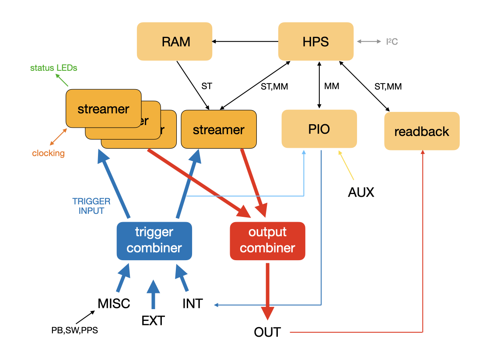
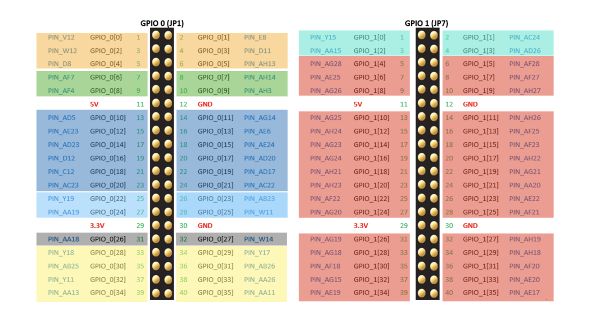
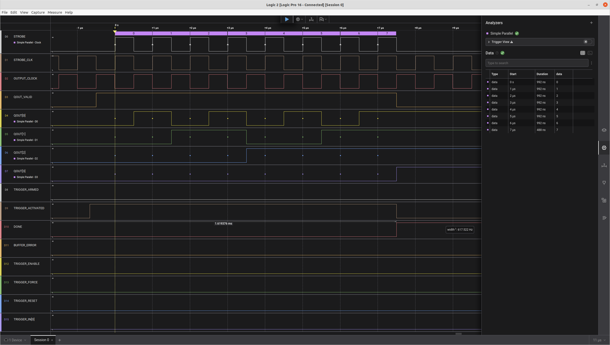

# PulsePins pulse sequencer

{: .heartbeat style="height:100px;width:100px"}
{ .blink-img }

PulsePins is a [feature-rich](about.md) general-purpose programmable pulse sequencer running on field-programmable gate array (FPGA) system-on-chip (SOC) modules.
It targets low-speed (up to 100MHz) applications on a moderate number of digital output channels (typically 32 or 64).
It is scriptable via Python and C++. It can run on small compact FPGA modules, such as
[Terasic DE10-Nano FPGA](https://www.terasic.com.tw/cgi-bin/page/archive.pl?Language=English&CategoryNo=167&No=1046)
(68.6mmx107mm footprint) using Ethernet connectivity.

Project repository: [https://github.com/rokzitko/PulsePins](https://github.com/rokzitko/PulsePins).

## Run-length encoding

Run-length encoding (RLE) is a data-compression technique in which consecutive identical values
are stored as pairs of value and length (number of repetitions). PulsePins decodes RLE sequences
and streams the resulting data to the output pins of an FPGA board or to other data sinks, such as
SerDes circuits that generate high-speed signals on transceiver ports. It supports complex
triggering with multiple trigger stages and multiple trigger input pins. The main application area
is timing-critical control of quantum and other experimental devices that require precisely
scheduled updates of signals (digital; analog via DAC boards; oscillatory via DDS boards). PulsePins is
distributed both as modifiable source code (Verilog, C++, Python), allowing adaptation to users’
individual needs, and as a pre-built SD-card image for a quick start.

This web site serves as the reference and user manual for PulsePins. It provides low-level implementation details,
interfacing with the hard processor system (HPS), API, software library (C++ and Python interfaces), and testing tools. Timing diagrams are also provided.

{: style="height:300px"}

HPS = hard processor system (ARM cores), ST = Avalon streaming interface, MM = Avalon memory-mapped interface, PIO = programmable input/output.

## General concept

Sequence _elements_ representing updates of the output data signals or control information (e.g. trigger settings) are
fed from the HPS through an Avalon streaming (AVS) bus via an input FIFO buffer to a RLE decoding core. The core
transmits the decoded signals to an output FIFO buffer, from which it is read out using a reading clock and provided
on the output pins. Reading out starts upon triggering. The input buffer has a preprocessor that can perform
high-level manipulations on the sequence (e.g. storing short segments in memory and replaying stored segments, i.e.,
second-level run-length decoding).

## Elements

The structure of each _element_ is as follows:

* ``control_t y``: control parameter
* ``count_t c``: counter payload
* ``value_t v``: value payload (output data, trigger patern, etc.)

This list defines the standard order (as transmitted via AVS) and the standard variable names (``y``, ``c``, ``v``) of
the three constituents. The types ``control_t``, ``count_t`` and ``value_t`` are unsigned integers, by default 32-bit,
i.e., ``uint32_t``; both the hardware description and the software library are written in such a way that expansion
(to e.g. 64-bit values) or narrowing (to e.g. 16-bit values) is easily accomplished. The control register contains
information about the exact meaning of the information contained in the two payload items: data updates ("regular
elements", also known as "symbols"), trigger patterns and masks ("trigger elements", "trigger conditions", or simply
"triggers"), sequence termination ("final elements", also known as "terminators"), preprocessor instructions (store,
replay).

### Composition of the control parameter

Defined in ``ip/streamer/config.vh`` (bit fields, 0 is LSB):

| Name               | Bit        | Description |
| -------           | ----------- | ----------- |
| BIT_TRIGGER       | 0           | regular element (0) or trigger element (1)                    |
| BIT_TRIGGER_FINAL | 1           | intermediate trigger element (0) or final trigger element (1) |
| BIT_TERMINATE     | 2           | data sequence terminator                                      |
| BIT_NO_STROBE     | 3           | strobe (0) or no_strobe (1)                                   |
| BIT_MODE*         | 4-7         | mode bits (load, set, clear, flip, invert, shift, etc.)       |
| BIT_NOPASS        | 8           | preprocessor bit (0 = pass unmodified, 1 = preprocess)        |
| BIT_STORE         | 9           | store in preprocessor memory                                  |
| BIT_POSITIONS*    | 10-13       | storage position                                              |
| BIT_REPLAY        | 15          | replay a sequence stored in the preprocessor                  |
| BIT_RETRIG        | 16          | retrigger request                                             |
| BIT_PRNG          | 17          | emit random numbers                                           |

### Element types

Regular elements represent data updates. The data can be strobed out (BIT_NO_STROBE low) or not (BIT_NO_STROBE high). In both cases
the data will be clocked out on the output bus using the streamer clock, but in the first case strobe signal will
indicate the validity of the data (see below about the exact timing of the strobe signal with respect to the streamer
clock). For flexibility, regular elements can either specify the new value on the output bus, or encode a change (bit
set, bit clear, bit flip, etc.). This is controlled by the "mode bits" in the control parameter.

All elements describing trigger sequences have the control bit 0 (BIT_TRIGGER) high. The final trigger element additionally has its
control bit 1 (BIT_TRIGGER_FINAL) high (preceding non-final elements have their bit 1 low); this special marking of the final trigger
element is often not needed, because the trigger will also fire when all trigger conditions in the condition queue are
exhausted. In simple cases, there will be a single trigger element in the sequence. The final trigger element
might be needed in cases where streaming is paused through a _retrigger request_. In this case, the trigger queue
needs to contain trigger condition subsequences separated by "final trigger" elements.

The trigger can also be forced by an internal signal (generated by the HPS, i.e., using a software library call) or an
external signal (digital input pin on the FPGA); in this case trigger elements in the sequence are not necessary.

The last (final) element in the sequence terminates the decoding, hence it is also known as the terminator. It has the
control bit 2 (BIT_TERMINATE) high. The value payload of the final element is decoded in the standard way (depending on the setting of
mode bits) and presented on the output as the persistent final state. The decoding of the terminator element also
marks the successful completion of a streaming run for the buffer-underrun detection circuit.

### Replay preprocessor

PulsePins has a "preprocessor" in the input pipeline.  This implements a second level of
run-length decoding (i.e., repetitions of the same sequence of run-length encoded events).

The preprocessor can store up to 8 elements (the size can be expanded).  A "replay" consists of
repeatedly emitting these elements back into the queue.  If the number of repetition is set to 0, the
elements are replayed indefinitely; this is a simple way for generating periodic signals (see the
[ppfg](ppfg.md) function generator tool).

## Multistreamer

Four instances of the RLE decoder are available. They run independently with separate triggering.
The results are combined to produce the final output signals. The combiner-multiplexer allows
bit-resolved inversion and masking at all inputs and outputs. There are multiple modes of operation:

* SEL1: select streamer 1
* SEL2: select streamer 2
* SEL3: select streamer 3
* SEL4: select streamer 4
* AND, OR, XOR, XNOR: bitwise logical operation for each bit taking inputs from all four streamers
* MAJ: majority, i.e., three out of four operation
* BLOCK8: takes 8 least-significant bits from each streamer to generate the four bytes of the output
* BLOCK16: takes 16 least-significant bits from streamer 1 and 2 to generate the output
* SUM12, SUM1234: algebraic sum of data from streamer 1 and 2, or 1, 2, 3, and 4
* DIFF12: algebraic difference of data from streamer 1 and 2

This design allows conditional streaming of different sequences based on the trigger conditions. Highly
complex digital patterns can be generated in this manner.

## DMA streaming

Streaming can proceed via direct memory access (DMA) up to 512MB in size without any intervention of the HPS, freeing
the processor for other tasks. Except for the difference in the data channel and speed, streaming from DMA
and through FIFO buffers is equivalent. For sequences with quickly changing signals at
high streamer_clk frequencies, it may happen that a FIFO buffer underflow occurs. Such errors are detected and indicated
by the buffer_error LED lighting up. These are the situations where the DMA method should be used.

## Output enable

By default, all outputs and the valid signal are in the high-Z state and act as inputs (see
[readback](readback.md) about using the device as a simple runlength-encoding logic analyzer).
To enable the output buffers, the output enable (``oe``) must be set high.

## Clocks and clock domains

PulsePins generates two clocks using the PLL: core clock and internal data streaming clock.
The default frequency of the core clock (core_clk) is 100MHz. The internal data
streaming clock (streamer_clk) also has a default frequency of 100MHz; this corresponds to 10ns
timing resolution for digital level updates. There is no length limit on the pulse duration, it is only limited by the clock.
Individual pulses can thus be as short as 10ns.

Data streaming clock can be switched between the internal and an externally-connected clock. The external clock needs to be
a 3.3V CMOS signal applied to a digital input pin of the FPGA (EXT_CLKp, see the table in the
following).

The interface between the two domains clock domains is the output dual-clock FIFO (DCFIFO), defined in
``ip/streamer/output_fifo.sv``.

## Signal routing

### Pinout on the DE10 Nano

The output data is presented on the GPIO 0 and GPIO 1 headers of Terasic DE10-nano board.

{: style="height:400px"}

Color code in the schematic:

| Color | Meaning |
| ----- | ------- |
| orange  | clocking |
| green    | status |
| blue  | triggering |
| yellow | aux I/O |
| cyan      | external clock inputs |
| red        | output data ports |

In the reference implementation for the DE10 Nano FPGA development board, the signals are present on the following GPIO
pins (defined in ``pulsepins.sv``):

| Connector | Index | Debug port | Name        | Description |
| --------- | ----- | ----       | ----------- | -------- |
| GPIO0     | 0     | D0         | streamer_strobe     | Data strobe |
|           | 1     | D1         | oe                  | Output enable |
|           | 2     | D2         | streamer_clk        | Streamer clock |
|           | 3     | D3         | streamer_qout_valid | Valid/enable signal for data output (qout) |
|           | 4     |            | activity            | Activity detected (high when data is being streamed out) |
|           | 5     |            | heartbeat           | Pulses when FPGA bitstream is loaded |
|           | 6     | D8         | trigger_armed        | PinPulse is waiting for the trigger event to occur |
|           | 7     | D9         | trigger_activated    | Triggered and data is being streamed out |
|           | 8     | D10        | done                 | Streaming out has completed without any underflow errors |
|           | 9     | D11        | buffer_error         | Buffer underflow error detected |
|           | 10    |            | ext_trigger_enable    | Trigger enable (make PinPulse sensitive to trigger signals) |
|           | 11    |            | ext_trigger_force     | External trigger force (unconditional) |
|           | 12    |            | ext_trigger_reset     | Reset the trigger circuit |
|           | 13    |            | gate_in               | Gate signal |
|           | 21:14 |            | ext_trigger_in[7:0]   | Trigger inputs |
|           | 22    | D12        | streamer_trigger_enable (out)  | Trigger enable (as seen by the streamer core) |
|           | 23    | D13        | streamer_trigger_force (out)   | Trigger force (as seen by the streamer core) |
|           | 24    | D14        | streamer_trigger_reset (out)   | Trigger reset (as seen by thestreamer core) |
|           | 25    | D15        | streamer_trigger_in[0] (out)   | Trigger input (as seen by the streamer core) |
|           | 26    |            | I2C SDA            | I2C interface data |
|           | 27    |            | I2C SCL            | I2C interface clock |
|           | 35:28 |            | AUX            | Auxiliary inputs |
| GPIO1     | 0     |            | EXT_CLKp    | External clock input |
|           | 1     |            | PPS_IN      | Pulse-per-second input (for synchronization and triggering) |
|           | 2     |            | PPCLK1      | External crystal clock 1 (for future use) |
|           | 3     |            | PPCLK2      | External crystal clock 2 (for future use) |
|           | 35:4  | D[7:4] for qout[3:0]     | streamer_qout | Data output, qout[31:0] |

Note that the table contains the "index" within the GPIO arrays, not the pin numbers on headers. The signals marked by
(out) and with the description "as seen by the streamer core" are output signals for monitoring. See the section on
the _trigger combiner_ module about mixing external, internal and on-board switch/button triggering signals.

### Status LEDS

PulsePins provides streaming status signals for status LEDs. The following signals are provided
(suggested colors for LEDs on [ppboards](ppboards.md) are also indicated):

* pin 0 - trigger_armed (blue)
* pin 1 - trigger_activated (yellow)
* pin 2 - done (green)
* pin 3 - buffer_error (red)

The meaning of these signals is explained in the table detailing GPIO port connections. The same
signals are also wired to the on-board green LEDs of the DE10-Nano board.

The remaining on-board LEDs on DE10-Nano board are connected as follows by default:

* pin 4: streamer_trigger_in[0]
* pin 5: streamer_trigger_in[1]
* pin 6: activity
* pin 7: heartbeat

Activity LED lights up if at least one low-to-high transition is detected within 200ms on the
streamer_strobe signal. Heartbeat pulses each second if the FPGA bitstream is loaded and
the clock is running (at the default rate of 100MHz).

## Trigger system

There are 8 trigger inputs in the current implementation. Trigger conditions are defined by a pattern and a mask. The
mask defines which trigger inputs are tested, while the pattern defines the target values.

The trigger conditions can be chained. The default implementation has a 256-position buffer for trigger conditions.
The trigger is activated when all trigger conditions in the chain have been consecutively fulfilled and a trigger condition element
marked as final has been encountered or the trigger buffer becomes empty.

Trigger is sensitive only when the _enable_ signal is high. The enable signal can be generated internally (via a
software call), externally (signal applied to a pin) or using switches (switch 0 set to ON); see
the section on [trigger combiner](#trigger-combiner) on details about the different trigger sources.

Trigger being _armed_ means that the data is available in the output FIFO and that the PulsePins core is waiting for
the trigger events to occur.

Trigger can be forced by an internal or external trigger_force signal, or using the physical switch number 2 on DE10-Nano board.

Trigger system can be _reset_ using the trigger_reset signal. The trigger reset deasserts the trigger activated signal.
It does not clear the trigger buffer! Holding the trigger reset signal asserted will prevent any triggering, even in
case of a trigger-force signal. The trigger reset can thus be used as a safety mechanism (e.g. as an interlock).

Trigger reset signal is also useful for the situations where the streaming needs to be stopped until a secondary
trigger occurs.

### Trigger combiner

Trigger combiner is a hardware circuit that accepts trigger inputs and control signals from
multiple sources. The source ports are named

* _internal_ (INT): software defined using a PIO interface,
* _external_ (EXT): connected through GPIO pins to connectors on a [ppboard](ppboards.md),
* _miscellaneous_ (MISC): pushbuttons and switches; detailed in the following.

The combiner circuits allows bit inversion on inputs and outputs, bit masking on inputs and
outputs, overrides on inputs and outputs, multiplexing or logic operations to combine the signals,
readback of all signals. All settings are under software control.

The multiplexer modes are the following:

* SEL1: select port 1 (INT)
* SEL2: select port 2 (EXT)
* SEL3: select port 3 (MISC)
* SEL4: select port 4 (not used)
* AND, OR, XOR, XNOR: bitwise logical operation for each bit taking inputs from all four ports
* MAJ: majority, i.e., three out of four operation

### Manual triggering using the physical buttons

Trigger inputs 0 and 1 are wired to KEY0 and KEY1 pushbuttons of the DE10-Nano board. In the
[trigger combiner](#trigger-combiner) circuit these two trigger signals are wired to the MISC trigger port.

### Manual trigger control

Trigger control signals are connected to the following switches of the DE10-Nano board:

* switch 0: trigger enable
* switch 1: trigger force
* switch 2: trigger reset

(Note: Switches are in OFF position when they are closer to the Arduino connector.)
In the [trigger combiner](#trigger-combiner) circuit these trigger controls are wired to the MISC
trigger port.

### Triggering on pulse-per-second signal (PPS)

PPS_IN signal is connected to pin 2 of the MISC port.

## Timing

Streaming is synchronous with the read clock which must be running continuously.

### Clocking (strobe)

Example of a successful decoding run of a short sequence (counter from 0 to 7). After the trigger is activated,
streamer_qout_valid is asserted at the next rising edge of streamer_clk. The data can be read out in two ways:

 * at the rising edges of streamer_clk, when streamer_qoud_valid is asserted
 * at the rising edges of streamer_strobe

Streamer strobe is asserted in the middle of the period (i.e., when streamer_clk is deasserted,
thus out of phase with the clock).

The first approach (using _valid_ semantics) is potentially more reliable at high frequencies,
because the signal is guaranteed to be settled at the rising edges of streamer_clk; there is no
guarantee for this to be the case at the rising edges of streamer_strobe (but in practice the
signals are stablized by then at all frequencies of practical interest).

The second approach (using _strobe_ semantics) is potentially more reliable in slow digital logic
systems which may have issues with high slew rates, i.e., those that require long hold times after
the rising edge of the clock signal in order for flip-flips to function reliably.

[ {: style="width:600px:height:600px"} ](img/seq1.png)

## Trigger monitoring

Trigger signals are connected to an input PIO (pio_trig_monitor) for monitoring purposes. Lower half of
the bits correspond to the external signals:

| Pin   | Name |
| ---   | ---- |
| 7:0   | ext_trig_in |
| 8     | ext_trig_enable |
| 9     | ext_trig_force |
| 10    | ext_trig_reset |

Upper half of the bits correspond to the signals as seen by the streamer cores (i.e., after being
processed in the trigger combiner):

| Pin   | Name |
| ---   | ---- |
| 23:16 | streamer_trig_in |
| 24    | streamer_trig_enable |
| 25    | streamer_trig_force |
| 26    | streamer_trig_reset |

Use [pptrig](pptrig.md) fpr debugging the triggering subsystem.

## Auxiliary inputs (AUX)

An eight bit digital bus is attached to an input PIO (pio_aux, lowest 8 bits) that can be read from
software, see [ppaux](ppaux.md).

## Extensions

PulsePins has been successfully extended to 64 output channels and to a 64-bit size of the count variable. Currently,
only the 32-bit version (32-bit for both data and count registers) is distributed as a prebuild binary.

PulsePins is easily portable to other Altera/Intel FPGA solutions and it has been tested, for example, on Arria 10
FPGAs for driving 10Gbps transceivers, specifically on [Terasic HAN
Pilot](https://www.terasic.com.tw/cgi-bin/page/archive.pl?Language=English&No=1133), reaching 100ps timing accuracy.
