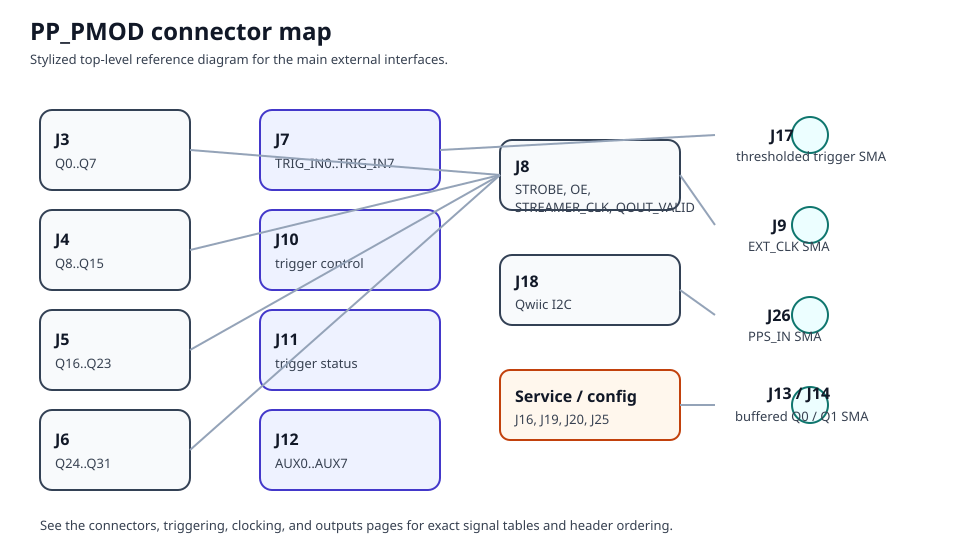

# PP_PMOD Reference Shield

`PP_PMOD` is the reference KiCad shield design for attaching PulsePins to the DE10-Nano GPIO headers and bringing the FPGA I/O out to lab-friendly connectors.

It is an optional hardware profile rather than a required baseline. The board is intended both as a usable shield and as a starting point for derivative designs with different connectors, buffering, or peripheral choices.

## Revision and source

The current top-level KiCad project is `pcb/ppshield_pmod/shield.kicad_sch` with title `PP_PMOD: GPIO shield for DE10-Nano`, revision `1`, and date `2025-09-20`.

Project files:

* KiCad sources: [`pcb/ppshield_pmod/`](https://github.com/rokzitko/PulsePins/tree/main/pcb/ppshield_pmod)
* Top-level schematic: [`shield.kicad_sch`](https://github.com/rokzitko/PulsePins/blob/main/pcb/ppshield_pmod/shield.kicad_sch)
* PCB layout: [`shield.kicad_pcb`](https://github.com/rokzitko/PulsePins/blob/main/pcb/ppshield_pmod/shield.kicad_pcb)

{: style="height:400px"}

## Feature summary

The reference design includes:

* four 8-bit output connector groups carrying `Q0..Q31`
* one 8-bit auxiliary connector carrying `AUX0..AUX7`
* a trigger-input connector group plus a separate SMA trigger input path
* two buffered SMA outputs for instrument connection
* SMA inputs for `EXT_CLK` and `PPS_IN`
* a Qwiic-compatible I2C connector for external modules
* an onboard `MCP9808` temperature sensor
* an onboard `AD5693` DAC with a separate low-noise regulator
* status, activity, and heartbeat LEDs
* testpoints and probe-grounding features
* optional oscillator-module footprints and optional input terminations

All of the external connector-facing signal groups in the design are protected with ESD devices.

## Board architecture

The KiCad hierarchy is already a good map of the board:

* `GPIO` connects the shield to the DE10-Nano headers
* `QOUT` handles the main 32-bit output bus and related control/status lines
* `output buffers` drives the two SMA output channels
* `Triggering` handles trigger connectors, trigger control/status, and the thresholded SMA trigger path
* `ext_clk` handles `EXT_CLK`, `PPS_IN`, optional termination, and oscillator-module options
* `I2C` contains the Qwiic connector, onboard `MCP9808`, and onboard `AD5693`
* `AUX` brings out the auxiliary bus
* `LEDs` drives the board indicators
* `Misc` contains testpoints and grounding aids

## Optional features

Several parts of the board are optional or configuration-dependent:

* the onboard DAC path is optional
* the onboard temperature sensor is optional
* the oscillator footprints are optional
* some terminations are selectable or optional
* the exact shield assembly may differ from the fully populated schematic

When documenting or validating the board, record which optional parts are populated and which jumper positions are used.

## Hardware reference

All board-level connectors, timing inputs, onboard peripherals, jumpers, and testpoints are documented on [PP_PMOD hardware reference](pp_pmod_reference.md).

## Connector index

Quick reference for the board's main external interfaces:

| Ref | Purpose |
| --- | --- |
| `J3`-`J6` | four 8-bit `QOUT` groups |
| `J7` | 8-bit trigger input bus |
| `J8` | QOUT sideband header |
| `J9` | `EXT_CLK` SMA input |
| `J10` | trigger control header |
| `J11` | trigger/status header |
| `J12` | `AUX` bus |
| `J13` | buffered `Q0` SMA output |
| `J14` | buffered `Q1` SMA output |
| `J17` | thresholded trigger SMA input |
| `J18` | Qwiic I2C connector |
| `J26` | `PPS_IN` SMA input |

## Validated workflows

Examples worth documenting or reproducing on this board include:

* LED PMOD output checks with [`pptest`](pptest.md)
* onboard `MCP9808` reads with [`pptemp`](pptemp.md) or `I2C/mcp9808.py`
* external Qwiic `TMP117` reads with `I2C/tmp117.py`
* DAC output checks with `I2C/ad5693_set_vout.py`
* PPS validation with [`ppts`](ppts.md)
* external clock validation with [`ppfreq`](ppfreq.md)
* trigger experiments with [`pptrig`](pptrig.md)

For these workflows, record board revision, population, jumpers, external wiring, exact commands, and observed behavior.
