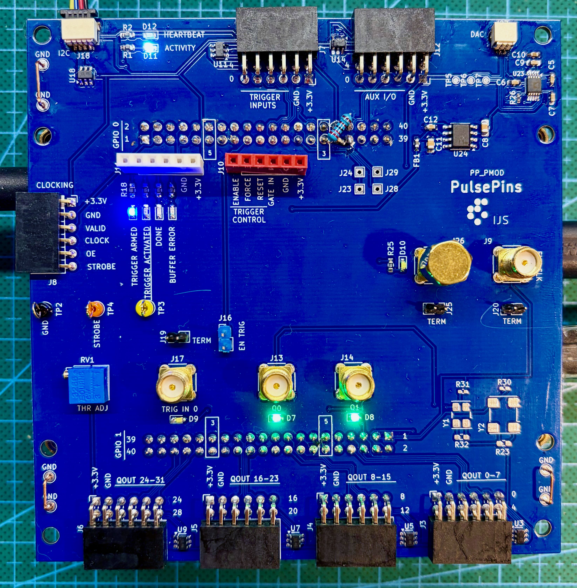

# ppboards - shields for the DE10-Nano board

ppboards are shields that plug into the two 40-pin 2.54 mm GPIO pin headers on the [DE10-Nano board](https://www.terasic.com.tw/cgi-bin/page/archive.pl?Language=English&CategoryNo=167&No=1046).
They enable custom interfacing of the FPGA module with the external world. As an example, a KiCad design for
a simple shield using PMOD-style expansion connectors is provided (`PP_PMOD`, described below). This reference design
can be used as is or it can serve as a starting point for user customization (different connectors, buffering, etc.).

For exact GPIO header pinouts and electrical limits, verify against the Terasic board documentation before designing or assembling a shield.

## PP_PMOD

This PulsePins shield board provides output signals broken out on four dual
[PMOD](https://digilent.com/reference/_media/reference/pmod/pmod-interface-specification-1_3_1.pdf)-style ports carrying 8
bits each. In addition, the board has expansion connectors for trigger inputs and AUX signals, separate header breakouts for
trigger control and status, and dedicated SMA connectors for clocking and instrument hookup. Other features:

* all signals on connectors have ESD protection diodes
* SMA connectors for external clock and for pulse-per-second (PPS) signals; monitoring LED for PPS
signal; optional built-in 50-ohm terminators (enabled by jumpers)
* SMA connector for one trigger signal; it is connected to a fast comparator with a tunable
threshold voltage; optional 50-ohm terminator; monitoring LED
* two buffered output signals are wired to SMA connectors; monitoring LEDs
* Status LEDs: trigger armed, trigger activated, done, buffer error
* Activity & heartbeat LEDs
* Qwiic I2C connector for external modules
* Optional onboard `MCP9808` temperature monitor (I2C interface)
* Optional 16-bit DAC (I2C interface) with separate low-noise power supply (a possible application
is frequency tuning of an OCXO; in combination with the PPS input from a GPS receiver, PulsePins can
serve as a simple GPSDO)
* Footprints for optional CMOS oscillator modules for clocking the PulsePins system
* Testpoints for troubleshooting
* GND connection bars for grounding oscilloscope probes

{: style="height:400px"}

Detailed board documentation:

* [PP_PMOD reference shield](pp_pmod.md)
* [PP_PMOD hardware reference](pp_pmod_reference.md)

KiCad schematics and PCB layouts, as well as the Gerber files for producing the boards, are [available
on the GitHub repository](https://github.com/rokzitko/PulsePins/tree/main/pcb/ppshield_pmod).
