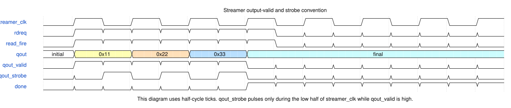
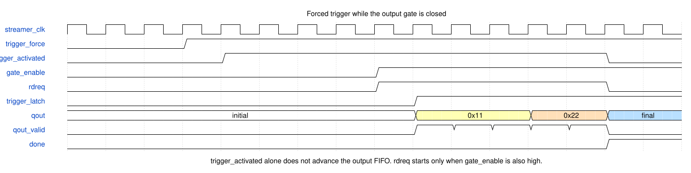
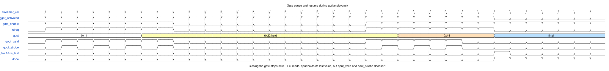
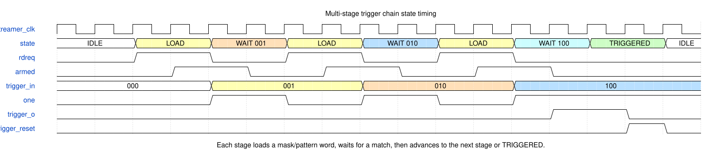
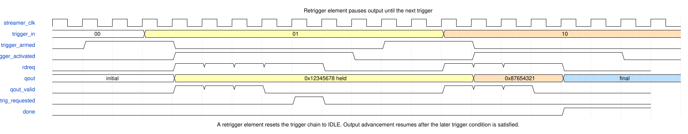
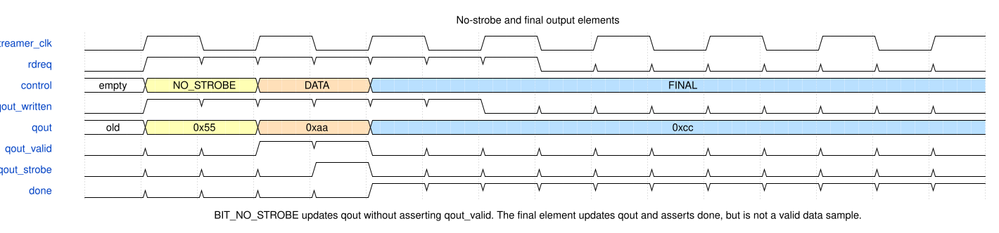

# Streamer timing diagrams

These diagrams summarize the observable timing conventions of the PulsePins streamer output and trigger path. They are idealized documentation diagrams derived from the RTL behavior and existing directed streamer testbenches, not measured logic-analyzer captures.

The main RTL references are [`streamer.sv`]({{ source_file("ip/streamer/streamer.sv") }}), [`output_fifo.sv`]({{ source_file("ip/streamer/output_fifo.sv") }}), and [`chain_trigger.sv`]({{ source_file("ip/streamer/chain_trigger.sv") }}).

The WaveDrom sources live under [`docs/wavedrom/streamer/`]({{ source_file("docs/wavedrom/streamer/") }}). Regenerate the checked-in SVGs with:

```bash
make -C docs timing-diagrams
```

## Output-valid and strobe convention

`qout` updates on rising edges of `streamer_clk` when the output FIFO supplies a data or final element. `qout_valid` marks ordinary data samples. `qout_strobe` is generated as `qout_valid & ~streamer_clk`, so it appears during the low phase of `streamer_clk`.

Sequence shown: ordinary data samples `0x11`, `0x22`, and `0x33`, followed by a final element that leaves the final value visible and asserts `done` because no prior `buffer_error` occurred. Only the ordinary data samples assert `qout_valid` and `qout_strobe`.

[](img/timing/output_strobe.svg)

RTL points:

* `qout_valid` is registered in [`output_fifo.sv`]({{ source_file("ip/streamer/output_fifo.sv") }}) from `valid = data_update && !is_no_strobe`.
* `qout_strobe` is `qout_valid & ~rdclk`.
* A final element updates `qout` and can assert clean `done` if no prior `buffer_error` occurred, but it is not a valid data sample.

## Forced trigger with a closed gate

Trigger activation and gate opening are separate conditions. In [`streamer.sv`]({{ source_file("ip/streamer/streamer.sv") }}), the output FIFO read request is:

```systemverilog
assign rdreq = trigger_activated && gate_enable;
```

If the trigger is forced while the gate is closed, `trigger_activated` can assert, but the output FIFO does not advance until `gate_enable` becomes high.

Sequence shown: 3 `streamer_clk` samples of `0x11`, then 2 samples of `0x22`, followed by a final element that leaves `qout` at `0x33`. The trigger is forced while the gate is still closed; output advancement starts only after `gate_enable` rises.

[](img/timing/trigger_gate_start.svg)

This mirrors the directed gating test in [`tb7.sv`]({{ source_file("ip/streamer/tb_streamer/tb7.sv") }}).

## Gate pause and resume

Gating is an output-side pacing mechanism. Closing the gate during playback stops new FIFO reads. The visible `qout` bus holds its previous value, while `qout_valid` and `qout_strobe` stop marking new samples.

Sequence shown: 3 samples of `0x11`, 2 samples of `0x22`, 2 samples of `0x44`, followed by a final element that leaves `qout` at `0x55`. The gate closes after the first `0x22` sample, so `qout` holds `0x22` while the gate is closed; the second `0x22` sample is emitted after the gate reopens. The `read_fire && is_last` marker is the output-FIFO event that writes the final value and, on clean runs, asserts `done` on the same `streamer_clk` edge.

[](img/timing/gate_pause_resume.svg)

This is the convention checked by [`tb9.sv`]({{ source_file("ip/streamer/tb_streamer/tb9.sv") }}). Consumers should use `qout_valid` or `qout_strobe` to detect advancement; `qout` itself may remain at the last value while the gate is closed.

## Multi-stage trigger chain

Trigger elements are loaded from the same encoded input stream as data elements, but they are consumed by [`chain_trigger.sv`]({{ source_file("ip/streamer/chain_trigger.sv") }}) rather than by the output decoder. The trigger chain runs in `streamer_clk` and advances through `IDLE`, `LOAD`, `WAIT`, and `TRIGGERED` states.

Trigger program shown: match `001`, then `010`, then final stage `100`. No `qout` data sequence is emitted in this diagram; it shows only trigger-chain loading, matching, and final trigger assertion.

[](img/timing/trigger_chain.svg)

The direct trigger-chain test is [`tb_chain_trigger/tb.sv`]({{ source_file("ip/streamer/tb_chain_trigger/tb.sv") }}).

## Retrigger flow

A retrigger element pauses output progression by requesting a trigger-chain reset. The sequence can then wait for another trigger condition and resume from the following output elements.

Sequence shown: the first trigger releases an output burst of `0x12345678` samples, then a retrigger element pauses progression. A second trigger releases `0x87654321` samples, followed by a final element.

[](img/timing/retrigger.svg)

This behavior is tested by [`tb5.sv`]({{ source_file("ip/streamer/tb_streamer/tb5.sv") }}). The key internal relationship is `retrig = retrig_requested && trigger_o` in [`streamer.sv`]({{ source_file("ip/streamer/streamer.sv") }}).

## No-strobe and final elements

`BIT_NO_STROBE` suppresses `qout_valid` and `qout_strobe`, but it still updates the `qout` data bus. A final element also updates `qout`; on clean runs it asserts completion through `done` rather than producing a valid data sample.

Sequence shown: a no-strobe element updates `qout` to `0x55` without asserting `qout_valid`, then a normal data element emits `0xaa` with `qout_valid` and `qout_strobe`, then a final element leaves `qout` at `0xcc` and, because no underrun occurred, asserts `done`.

[](img/timing/no_strobe_final.svg)

The direct output-FIFO regression is [`tb11.sv`]({{ source_file("ip/streamer/tb_streamer/tb11.sv") }}), and final-output behavior is covered by [`tb6.sv`]({{ source_file("ip/streamer/tb_streamer/tb6.sv") }}).

## Reading the diagrams

The diagrams intentionally show short, readable examples. Exact cycle counts around FIFO availability and trigger-program loading can vary with the chosen clock relationship and FIFO state. The stable conventions are the ownership of output timing by `streamer_clk`, the `rdreq = trigger_activated && gate_enable` gating rule, the `qout_valid` sample qualifier, and the low-phase `qout_strobe` convention.
