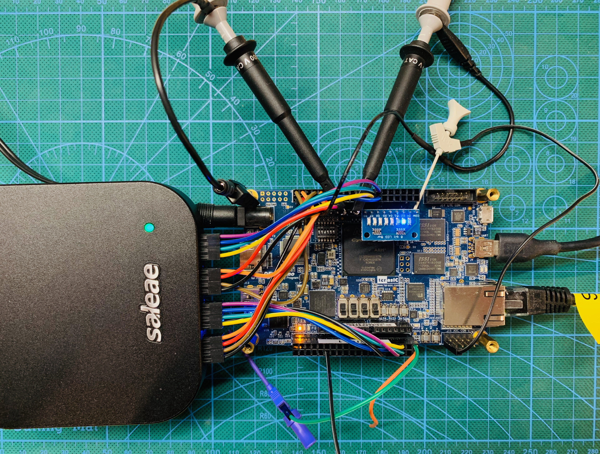

# Testing procedures

PulsePins was designed from the start to support a high degree of internal self-testing. For this
reason, the FPGA fabric includes a run-length encoder for reading back the generated stream and
comparing it against expected results. These tests are performed with the [pptest](pptest.md)
tool. A collection of shell scripts can be found in the [`tests/`]({{ source_file("tests/") }}) subdirectory. To start one sweep
of the test battery, run [`run_all_tests`]({{ source_file("tests/run_all_tests") }}). If any error is encountered, testing stops immediately.
Successful completion is reported by printing the message ``SUCCESS``.

One can run the tests continuously using [`run_all_tests_forever`]({{ source_file("tests/run_all_tests_forever") }}) to perform intensive
stress testing. Logs are collected under `/var/volatile/pulsepins-test-logs` for inspection:
`report` records the `pptest` version, bitstream timestamp, and successful-run timestamps, while
`report.run_N` files contain per-run output. Pass `-no-report-files` to avoid writing the
accumulating `report.run_N` files during long burn-in runs. The runner exits with failure on the
first failed sweep, including child processes killed by signals.

## Wiring up for testing

Recommended color coding for connecting the DE10-Nano to a Saleae logic analyzer is provided in
the comments in the [`pulsepins.sv`]({{ source_file("pulsepins.sv") }}) design file.

The image below shows a testing jig. It uses custom cables to connect the logic
analyzer to both GPIO ports. Eight bits of qout on the Arduino port are connected to LEDs.
An oscilloscope is connected to clock signals on the Arduino port. Some wires for hooking up
external clock sources are also visible.

{: style="width:800px"}

## Arduino header

Some signals are additionally brought out on the Arduino header for testing purposes.

| Port   | Name |
| ------ | ---- |
| D[7:0] | streamer_qout[7:0] |
| D8     | streamer_clk (internal or external, as configured) |
| D9     | core_clk (PLL output) |
| D10    | int_clk (PLL output) |
| D11    | streamer_qout[0] |
| D12    | streamer_qout[1] |


## Manual testing

Some test procedures require additional external test equipment or external wiring.

### Manual board smoke

For a quick hand-run live-board regression check from the repository root, use:

```bash
make board-smoke
```

This is intentionally smaller and faster than [`run_all_tests`]({{ source_file("tests/run_all_tests") }}): it redeploys the local board artifacts, reloads the FPGA, runs a few finite `pptool` checks, and exercises both `ppscpi` and `ppwebgui` over the network. Override the target board with `TARGETHOST=...` if needed.

For the host-side precursor check before touching the board, run:

```bash
make dev-check
```

Use the three levels like this:

* `make dev-check` - host-side sanity pass
* `make board-smoke` - fast manual live-board regression test
* [`run_all_tests`]({{ source_file("tests/run_all_tests") }}) - intensive on-board validation sweep

### Random number generator

The built-in random number generator can be tested by running ``pptest 19``. By connecting
an output signal to a spectrum analyzer, one can examine the whiteness of the spectrum.
When Q0 or Q1 is suitable, use the buffered SMA outputs on the [PP_PMOD board](ppboards.md);
use appropriate external buffering or probing for other outputs.
